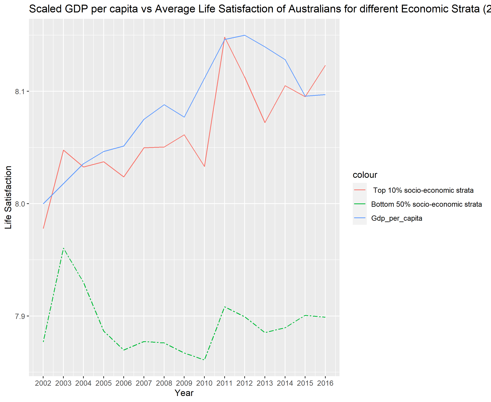

Exploring HILDA data in a reproducible framework
=========================
*Final Project Submission for the Effective Programming Pracitces Module - Abraham Raju (3296612)*

This repository aims to reproducibly explore the data from the HILDA (The Household,Income and Labour Dynamics in Australia) Survey,a household panel study that collects information about economic and personal well being,labour market dynamics,and family life. The survey began in 2001 and now contains 19 waves of longitudinal panel data about 17,000 Australians.
The participants are followed over the course of their lifetime.

The main variables of our interest are self assessed outcomes that provide a reflection on general life satisfaction,sense of safety,sense of risk taking and more.

This repository is part of a ongoing project at the Max Planck Institute of Collective Goods under Dr. Lukas Kiessling, and such all rights are credited to the institute.

Tools
-------
This project was created using the tools introduced in the coursework of Prof. Gaudecker's Effective Programming Course and includes but are not limited to:

* **Github/Git** - Allowing for collaboration among multiple researchers,in addition to seamlessly integrating with the 'Framework for Reproducible Economic Research', as well as for version control and code hosting.


* **Templates for reproducible research projects** - The repository is build around the waf.py template (now replaced by pytask in the latest iteration). Please find the documentation [here](https://econ-project-templates.readthedocs.io/en/stable/index.html).

* **R** - The project relies extensively on *tidyverse,dplyr,ggplot,plm* and other packages. The main packages in use are listed under *References*.

* **Secondary tools** - Rocket Chat, Dropbox, Zulip and Zoom accounted for secure 'last-mile' communication and file transfers.


Motivation
------
The motivations for the project include the hope and expectation of:

* Gaining further experience working with 'big' panel data.
* Train a collaborative workflow,to discuss and adapt the projects in constant communication with fellow researchers.
* Incorporating a completely reproducible research template into a project involving a real-world data set.
* Work with ggplot2,a highly dynamic and popular R plotting library
* Gain improved working knowledge of estimation methods,especially in panel data using both balanced and unbalanced data sets.
* The ability to visualize and identify linear time trends as well as glean interesting nuggets from cross sectional data sets.
* Streamling and speeding up R code by modularizing functions as well as reducing redundant processing tasks.
* Program functionally, according to the tenants of reproducible scientific programming.


Getting Started
===============

First download the repository to your local machine. If you use Github,
then this will mean cloning the repository into a new R project. If you
are not a Github user, simply click 'Download Zip' and extract the file
to a convenient location.

Repository Contents
-------------------

The repository contains several folders and files. They are organized to
keep data preparation and cleaning in one file, analysis in
another, and outputs from the analysis that will become
tables and figures, and numbers in the text of the manuscript. Next, we'll demonstrate how to link
the raw data to the analysis to the output to the manuscript so that all
the steps to generate the figures are automated and thus, not subject
to the inconsistencies that go along with piece-wise data preparation
and analysis.

Generate the Output with One Click(s)
======================================

    
1. Access the data - The project requires the use of the HILDA Panel Study data.Access requires that you complete and sign a once only Confidentiality Deed Poll and email the scanned, signed copy to NCLD (ncldresearch@dss.gov.au) and ADA (ada@anu.edu.au).Please refer [here](https://dataverse.ada.edu.au/dataverse/ncld) for further info.


2. Set up your system to process automated building of projects. Refer to [Template for reproducible research projects](https://econ-project-templates.readthedocs.io/en/stable/r-example.html). Warning- This project uses a prior build system using waf.py as opposed to the newer pytask.
3. Download the Files  `STATA 180c (Zip File 1 of 2 - Combined Data Files)_V2 ` and `2. STATA 180c (Zip File 2 of 2 - Other Data Files)_V2 ` and extract them into `.\life_events\src\original_data`.

4. Install and intialize the virtual environment `life_events`. For windows conda users this can be done by 
 
    ```R
    conda env create -f .\life_events\environment.yml
    conda activate life_events
    ```
    
5. To receive the outputs, run the following
    ```R
    python waf.py 
    ```
  


Now we see the contents of the data and analysis files and how they come
together.

The `data_management` Folder
---------------------
The file `preprocessing.r` contains instructions to fetch the required variables from the HILDA Panel data, from the waves from 2002 to 2016. The variables being fetched include all the outcomes of interest,the life events we are interested in as well as many control variables and variables of interest for additional plotting.
   Life Event| Description
   --- | --- |
  "Widowed"| "death of a spouse or a child"|
  "Separated" | "separated or divorced from a spouse or long-term partner",
  "Money lost" | "major worsening in financial situation (e.g. bankruptcy)",
  "Jailed"| "detained in jail / correctional facility",
  "Attacked"| "victim of physical violence (e.g. assault)",
  "Health shock"| "serious personal injury or illness (e.g., disability)",
  "Reconciled"| "reconciled with spouse/long-term partner after separation",
  "Fired"| "fired or made redundant by an employer",
  "Family harmed"| "serious injury or illness to a close family member",
  "Robbed"| "victim of property crime (e.g. theft, house breaking)",
  "Friend died"| "death of a close friend",
  "Relative died"| "death of a close family member (e.g. parent or sibling)",
  "Relative jailed"| "jail for a close friend or relative",
  "Moved"| "changed residence",
  "Hired"| "changed jobs (i.e. employer)",
  "Promoted"| "promoted at work",
  "Retired"| "retired from workforce",
  "Money gained"| "major gain in finances (e.g., lottery win, inheritance)",
  "Pregnant"| "you (or your partner) got pregnant",
  "Married"| "got married",
  "Childbirth"|"birth (or adoption) of a child"
  
  Outcome| Description
   --- | --- |
  "Health Satisfaction"| "Self Assessed satisfaction with your health"|
  "Safety Satisfaction" | "Satisfaction with your personal safety",
  "Risk tolerance" | "Financial risk prepared to take",
  "Financial Situation" | "major worsening in financial situation (e.g. bankruptcy)",
  "Mental Health" | "SF-36 mental health",
   

**Dependencies** 

The `GetRaws` function accepts the list of HILDA dataframes,and returns a 'long' dataframe containing the variables of interest.
```r
GetRaws <- function(df.list, var.codes) {
..
}
```
This function `GetMCS.r` takes the list of HILDA data frames and calculates the MCS for every viable respondant in the list. It returns a long data frame containing xwaveid, wave, code and value.
  
The function `GetEventTimes.r` takes the list of event names of interests,extracts the variables using `GetRaws.r` and create extracts them. It also creates new variables with leads and lags of each event.This allows us to test the before and after,long term effect on outcomes both leading up to the event and after it.

  
In this file,we handle all the preparation so that
the objects created by this script are ready to be accepted in the
`analysis` folder.

The `analysis` Folder
---------------------

The `analysis` folder contains the code to estimate the conditional and unconditional effects of life events both immediately after,before and the long term before and after effects on different outcome variables.

The estimates for the of effects of life events are then stored to be plotted for the variables for 'Health Satisfaction',' Risk preference' and 'Sense of Safety'.


`analysis_conditional.R` contains code to filter the columns of interested from the data sets preprocessed in `data management`. `analysis_conditional.R` extracts not all the event of interest but also other life events to estimate the effect of each life event,conditioned on other confounding events,as well as controlled for factors like demographics and wealth bracket.

We also estimate the differing impacts on different age groups,income strata,and on different outcomes such as 'Financial risk prepared to take','Sense of safety' and 'Health Satisfaction'.

`analysis_unconditional.R` contains code to estimate the unconditional effects of life events,using only the event as the independent variable.


**Dependencies** 

`conditionalModels.r` function creates the covariate data frame,the outcome column and joins them for panel data regression using plm and indivual fixed effects for each life event seperately and for each lagged and leading time periods,and also depending on the marker received from `analysis_conditional.R`, produces coefficients for top and bottom 50% economic strata,and for different genders and ages.

`conditionalModels.r` function estimates similarly but nonconditionally and estimates the effect of only the life event on the ouctome of interest.


The `final` Folder
---------------------

The final folder contains the code to produce plots and tables resulting from the `analysis` folder.


`conditional_model_plot.r`  uses the coefficients generated from the `analysis` folder to draw the plot to show the relative changes in
the outcome variable 'Health Satisfaction' for each life event over the time periods,and for different demographic groups.To do so, it uses the `psth.r` function.

`unconditional_model_plot.r` does the same for the unconditional models,but in addition also for the outcome variables 'Financial Safety' and 'Sense of Safety'.

**Dependencies**

`psth.r` modularizes the plotting for each outcome variable for each life events depending on the set of coefficents and events names passed as arguments. This allows us to use the same function to plot the outcome of interests for all, for different wealth stratas and age bands and for  conditional and unconditional models using the same function.


**Part I : Impact of Life events on Overall Health and Emotional Health Satisfaction**
------------------------------------------------------------------------
<br/>
<br/>


The figures below show the unconditional effects on the outcome variables emotional satisfaction and health satisfaction for positive and negative events.


:bulb: Marriage and Childbirth tends to have positive emotional and health benefits leading up to the event,which gradually dissipates in the medium term following the event. Reconcilation appears to lead to an immediate improvement in general wellbeing.


The figures below show the unconditional effects on the outcome variables financial security and risk aversion (higher is more averse) for positive and negative events.
<br/>
<br/>


**Part II : Impact of Life events on Sense of Financial Safety and Risk Aversion**
------------------------------------------------------------------------
<br/>
<br/>


:bulb: Unexpected windfall raises sense of financial security while reducing risk aversion.Any event directly leading to a improvement of financial security is associated with increased risk taking.This effect lasts significantly over time.


:bulb: Losing money significantly increases risk aversion over both the short and long term,and greatly reduced sense of financial safety. The impact of losing money is significantly high,and persists for a longer period of time than the coverse effects of unexpected windfalls.


To evaluate whether the same effects are present when conditional on all other coinciding life events and controls such as demographics and education,we run the conditional regression of life events on the outcome variables.


**Evaulating the gender differential in impact of Life Events : Do women and men react differently?**
------------------------------------------------------------------------


:bulb: Childbirth seems to cause an immediate and long-lasting improvement in both emotional and general well being for females,while the effects seem to not be as visible for males.


**Evaulating the Socio-Economic differential in impact of Life Events : Do different stratas of society experience events differently?**
------------------------------------------------------------------------
We can further plot the trends of life satisfaction among different economic strata in Australia,as well as for different age groups.
##


:bulb: The life satisfaction of the top strata seems to remarkably follow a similar trajectory to the gdp per capita of Australia,while no such relationship seems to exist for the lower strata.




##

Studying this further with respect to the impact of life events can answer the question whether Life events have different magnitude of effects of emotional and physical health based on your pre existing economic means.


**Part III : Identifying the Influencing factors of Job Satisfaction**
------------------------------------------------------------------------
#
We assess the influencing factors for job satisfaction among these self assessed variables:


|Variable   |Description                                                       |
|:-------|:-----------------------------------------------------------------|
|jomcsb  |The company I work for will still be in business 5 years from now |
|jomcd   |My job is complex and difficult                                   |
|jomfw   |Freedom to decide when to work                                    |
|jomls   |I have a lot of say about what happens on my job                  |
|jomfd   |I have a lot of freedom to decide how I do my own work            |
|jomns   |My job often requires me to learn new skills                      |
|jompf   |I get paid fairly for the things I do in my job                   |
|jomsf   |I have a secure future in my job                                  |
|jomus   |I use many of my skills and abilities in my current job           |
|jomms   |My job is more stressful than I had ever imagined                 |
|jomwf   |I worry about the future of my job                                |
|jomvar  |I worry about the future of my job                                |
|jomtime |I dont have enough time to do everything in my job                |
|jomrpt  |My job requires me to do the same things over and over again      |
|jomflx  |My working times can be flexible                                  |
|jomdw   |I have a lot of choice in deciding what I do at work              |


|Variable   |Description                                                  |
|:-------|:------------------------------------------------------------|
|jbmsall |Overall job satisfaction                                     |
|jbmsflx |The flexibility to balance work and non-work satisfaction    |
|jbmshrs |The hours you work satisfaction                      |
|jbmspay |Total pay satisfaction                      |
|jbmssec |Job security satisfaction                                    |
|jbmswrk |The work itself satisfaction                                 |
|jbmtuea |IDV: Union membership or employee association (dont know=no) |


<br/>
<br/>
Now let's run a fixed effect panel data regression on the influence positive and negative factor on general satisfaction in a workplace.
<br/>
<br/>


Using a ordered logit regression as a robustness check,considering that job ranking is an ordered ranking variables. Ordered logit allows us to maintain the information contained in the inherent ordering of the ranking.


The correlation plot shows us that there is a degree of correlation among many of the independent variables,and to filter out only relevant variables of interest to determine the best markers for better job satisfaction,we can use Elastic Net and LASSO for Feature Selection.


The lasso plot shows how the variables are penalized,allowing us to select the variables most likely to predict job satisfaction.


Using the variables to rerun the initial regression,we have:


:bulb: The important variables are in line with existing research on job satisfaction,
Interesting work and personal skills as well as flexibility in both ability to decide work times and decision making are all critical factors in positive job satisfaction.

References
==========


Gaudecker et. al, 2013, *Templates for reproducible projects*, available at https://econ-project-templates.readthedocs.io/en/stable/index.html

Wickham, Hadley, and Jennifer Bryan. 2019. readxl: Read Excel Files. https://CRAN.R-project.org/package=readxl.

Wickham, Hadley, and Lionel Henry. 2019. tidyr: Tidy Messy Data. https://CRAN.R-project.org/package=tidyr.

Wickham, Hadley, and Jim Hester. 2018. readr: Read Rectangular Text Data. https://CRAN.R-project.org/package=readr.

Wickham, Hadley, and Evan Miller. 2018. haven: Import and Export SPSS, Stata, and SAS Files. https://CRAN.R-project.org/package=haven.

Bache, Stefan Milton, and Hadley Wickham. 2014. magrittr: A Forward-Pipe Operator for R. https://CRAN.R-project.org/package=magrittr.

Summerfield, M. , Bevitt, A. , Freidin, S. , Hahn, M. , La, N. , Macalalad, N. , O’Shea, M. , Watson, N. , Wilkins, R. & Wooden, M. (2017) HILDA User Manual – Release 16 (Melbourne, Australia: Melbourne Institute of Applied Economic and Social Research, University of Melbourne).

Nathan Kettlewell, Richard W. Morris, Nick Ho, Deborah A. Cobb-Clark, Sally Cripps, Nick Glozier,2020,
'The differential impact of major life events on cognitive and affective wellbeing',  SSM - Population Health,
Volume 10.

Fried, Yitzhak, and Gerald R. Ferris. “The validity of the job characteristics model: A review and meta‐analysis.” Personnel Psychology 40.2 (1987): 287-322.

 Hlavac, Marek (2018). stargazer: Well-Formatted Regression and Summary Statistics Tables.
 R package version 5.2.2. https://CRAN.R-project.org/package=stargazer
